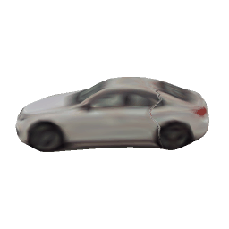
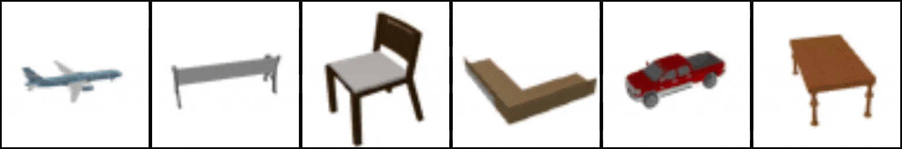

# UNICORN :unicorn:

<div align="center">
<h2>
Share With Thy Neighbors:<br> Single-View Reconstruction by Cross-Instance Consistency
<p></p>

<a href="https://imagine.enpc.fr/~monniert/">Tom Monnier</a>&emsp;
<a href="https://techmatt.github.io/">Matthew Fisher</a>&emsp;
<a href="https://people.eecs.berkeley.edu/~efros/">Alexei A. Efros</a>&emsp;
<a href="https://imagine.enpc.fr/~aubrym/">Mathieu Aubry</a>

<p></p>

<a href="https://imagine.enpc.fr/~monniert/UNICORN/"></a>
<a href="https://arxiv.org/abs/2204.10310"></a>
<a href="https://github.com/monniert/unicorn"></a>
<a href="https://imagine.enpc.fr/~monniert/UNICORN/ref.bib"></a>
<p></p>


</h2>
</div>

Official PyTorch implementation of [**Share With Thy Neighbors: Single-View Reconstruction by Cross-Instance Consistency**](https://arxiv.org/abs/2204.10310) (ECCV 2022).
Check out our [**webpage**](https://imagine.enpc.fr/~monniert/UNICORN) for video results!

This repository contains:

- scripts to download and load both datasets and pretrained models
- demo to reconstruct cars from raw images (script or [interactive notebook ](https://imagine.enpc.fr/~monniert/UNICORN/demo))
- configs to train the models from scratch
- evaluation pipelines to reproduce quantitative results
- guidelines to train a model on a new dataset

<details>
<summary>If you find this code useful, don't forget to star the repo :star: and cite the paper :point_down:</summary>

```
@inproceedings{monnier2022unicorn,
  title={{Share With Thy Neighbors: Single-View Reconstruction by Cross-Instance Consistency}},
  author={Monnier, Tom and Fisher, Matthew and Efros, Alexei A and Aubry, Mathieu},
  booktitle={{ECCV}},
  year={2022},
}
```

</details>

<details>
<summary><b>Major code updates :clipboard:</b></summary>

- 08/22: pytorch 1.10 instead of 1.5, big models, kp_eval.py, eval with gradient-based ICP with aniso scale, pascal3D car chamfer eval
- 05/22: first code release

</details>

## Installation :construction_worker:

### 1. Create conda environment :wrench:

```
conda env create -f environment.yml
conda activate unicorn
```

<details>
<summary><b>Optional visualization :chart_with_downwards_trend:</b></summary>
Some monitoring routines are implemented, you can use them by specifying your
visdom port in the config file. You will need to install visdom from source beforehand

```
git clone https://github.com/facebookresearch/visdom
cd visdom && pip install -e .
```
</details>

### 2. Download datasets :arrow_down:

```
bash scripts/download_data.sh
```

This command will download one of the following datasets:

- `ShapeNet NMR`: [paper](https://arxiv.org/abs/1512.03012) / [NMR 
  paper](https://arxiv.org/abs/1711.07566) / 
  [dataset](https://s3.eu-central-1.amazonaws.com/avg-projects/differentiable_volumetric_rendering/data/NMR_Dataset.zip)
  (33Go, thanks to the [DVR 
  team](https://github.com/autonomousvision/differentiable_volumetric_rendering) for hosting 
  the data)
- `CUB-200-2011`: [paper](https://authors.library.caltech.edu/27452/1/CUB_200_2011.pdf) / 
  [webpage](http://www.vision.caltech.edu/visipedia/CUB-200-2011.html) /
  [dataset ](https://data.caltech.edu/tindfiles/serve/1239ea37-e132-42ee-8c09-c383bb54e7ff/) 
  (1Go)
- `Pascal3D+ Cars`: [paper](https://cvgl.stanford.edu/papers/xiang_wacv14.pdf) /
  [webpage](https://cvgl.stanford.edu/projects/pascal3d.html) (with ftp download link, 7.5Go) / [UCMR
  annotations](https://people.eecs.berkeley.edu/~shubham-goel/projects/ucmr/cachedir-others.tar.gz)
  (bbox + train/test split, thanks to the [UCMR team](https://github.com/shubham-goel/ucmr/) for hosting them) / 
  [UNICORN annotations](https://imagine.enpc.fr/~monniert/UNICORN/data/unicorn_anno.zip)(3D shape ground-truth)
- `CompCars`: [paper](http://mmlab.ie.cuhk.edu.hk/datasets/comp_cars/CompCars.pdf) / 
  [webpage](http://mmlab.ie.cuhk.edu.hk/datasets/comp_cars/) / 
  [dataset](https://s3.eu-central-1.amazonaws.com/avg-projects/giraffe/data/comprehensive_cars.zip) 
  (12Go, thanks to the [GIRAFFE team](https://github.com/autonomousvision/giraffe/) for 
  hosting the data)
- `LSUN`: [paper](http://arxiv.org/abs/1506.03365) / [webpage](https://www.yf.io/p/lsun) / 
  [horse dataset](http://dl.yf.io/lsun/objects/horse.zip) (69Go) / [moto 
  dataset](http://dl.yf.io/lsun/objects/motorbike.zip) (42Go)

### 3. Download pretrained models :arrow_down:

```
bash scripts/download_model.sh
```

We provide a small (200Mo) and a big (600Mo) version for each pretrained model (see training section for details).
The command will download one of the following models:

- `car` trained on CompCars: [car.pkl](https://drive.google.com/file/d/16aIw88ZiAUFUOOBFXdHOUNtJ1-w3zpJG/view?usp=sharing) / 
  [car_big.pkl](https://drive.google.com/file/d/1i7HF8EhI--EeES8X8GfN2wDzopulV5Z7/view?usp=sharing)
- `car_p3d` trained on Pascal3D+: [car_p3d.pkl](https://drive.google.com/file/d/1p3ow2LjgrkI3Rcdk-51w2qMg7vxV6doX/view?usp=sharing) /
  [car_p3d_big.pkl](https://drive.google.com/file/d/1N7njgw5tde9wWS6Nwc8WFgJJL61Xu_rs/view?usp=sharing)
- `bird` trained on CUB: [bird.pkl](https://drive.google.com/file/d/1nWrmMCjeJzK5nHhZ021CCYS-51LTpKHe/view?usp=sharing) /
  [bird_big.pkl](https://drive.google.com/file/d/1BsUFIYFnrwaMFzW25wx26vg8MS8hZloy/view?usp=sharing)
- `moto` trained on LSUN Motorbike: [moto.pkl](https://drive.google.com/file/d/1wuVjllVUSVWUyfoleSHd2qKiET-x-l1i/view?usp=sharing) /
  [moto_big.pkl](https://drive.google.com/file/d/1A9u-Pmc7UbC2n7Q3bfikFgKNFuKiq9jN/view?usp=sharing)
- `horse` trained on LSUN Horse: [horse.pkl](https://drive.google.com/file/d/1DoJ0HQ60veEPTmWB4JJ_NGQa5U_48Yhs/view?usp=sharing) /
  [horse_big.pkl](https://drive.google.com/file/d/1V6_XcegVNGHCRRwN2M_IvGL0_bcwhQtV/view?usp=sharing)
- `sn_*` trained on each ShapeNet category: 
  [airplane](https://drive.google.com/file/d/1WkqfL7zoOrPegHoZCFxy8kTI_DTnFj1W/view?usp=sharing), 
  [bench](https://drive.google.com/file/d/1__EgJZTtz2y3xI963vgY6j3-kTz8tHaC/view?usp=sharing), 
  [cabinet](https://drive.google.com/file/d/1Yql_enYUniDDP8HXhQ-ZD9hWuvpI6wj6/view?usp=sharing), 
  [car](https://drive.google.com/file/d/1nF_xJfdUsepUkN-i88WaJYpR8RHKCCxI/view?usp=sharing),
  [chair](https://drive.google.com/file/d/1sDdERppgW-q3pCoATCcbVrBNsY5cbPB6/view?usp=sharing),
  [display](https://drive.google.com/file/d/1q93zt9cJKO4rrNkQ2NkqqIHikd2xm0LG/view?usp=sharing),
  [lamp](https://drive.google.com/file/d/1kDV9ulT9ip1cQKamauX-YgPFuCnF1w3G/view?usp=sharing),
  [phone](https://drive.google.com/file/d/1MpUnyb9w6ZE7_EKUkz35JdADRueW9zDO/view?usp=sharing),
  [rifle](https://drive.google.com/file/d/1L5TXJldoeoBshgHuPd3rsSAmz_lCMnjt/view?usp=sharing),
  [sofa](https://drive.google.com/file/d/1u2Mi4hf2_pfmWVLEcsrekaNcrK-6XOew/view?usp=sharing),
  [speaker](https://drive.google.com/file/d/1ZoEOmtnB6aYH05fD0tJba038Wbk1ZLf7/view?usp=sharing),
  [table](https://drive.google.com/file/d/1MwGZpFaadA-3fA1WpXKmX-v7btXcuZJ7/view?usp=sharing),
  [vessel](https://drive.google.com/file/d/1-2Jwek4GmYDciRNu2K6zsMlyW7c3krBl/view?usp=sharing)
- `sn_big_*` trained on each ShapeNet category: 
  [airplane](https://drive.google.com/file/d/1LHWcswUfMwZpuihb8ZC5IJnvJxZcRpEF/view?usp=sharing),
  [bench](https://drive.google.com/file/d/1fm5uc_i_KR1fHcdzg3lK3pShtfEdbsnn/view?usp=sharing),
  [cabinet](https://drive.google.com/file/d/1MB32hZrmRBSmMoKmewbiLB51eqSu6-bd/view?usp=sharing),
  [car](https://drive.google.com/file/d/1aMPFkXAkDKa9CDy9iX5RTzjDO5N8h0t7/view?usp=sharing),
  [chair](https://drive.google.com/file/d/1pzsZ482Q5utMUeYjehkYpRO3Eo7Rkg4h/view?usp=sharing),
  [display](https://drive.google.com/file/d/1_6I9K3rtv81uj-cRvFT9Nyqn1nBrj6zf/view?usp=sharing),
  [lamp](https://drive.google.com/file/d/15Gg4CB7oOWwmKCGcZ8BIyZzA38buVLRM/view?usp=sharing),
  [phone](https://drive.google.com/file/d/1kyWehfJN8lUojqMXLNTdgDVFt_wDFmbI/view?usp=sharing),
  [rifle](https://drive.google.com/file/d/1FIMAK-hnW8UvEY1YRsJZV7W97_t47_BT/view?usp=sharing),
  [sofa](https://drive.google.com/file/d/19ZHsc9XbNRi6u3uhMx8s4v0jFSgFw-vf/view?usp=sharing),
  [speaker](https://drive.google.com/file/d/1YJgDm4EYP33DG2pyUHgHnjajMyLI_WPJ/view?usp=sharing),
  [table](https://drive.google.com/file/d/1UrQCuk_bDiv9rx4ZAhFTiqSJNUKIf-AW/view?usp=sharing),
  [vessel](https://drive.google.com/file/d/1r0Ae3LQGKGDeoGGTwCLj22cMjUnA-B-S/view?usp=sharing)

<details>
<summary><b>Important notes :page_with_curl:</b></summary>

1. :exclamation:The small models released here correspond to an old version of the code with in particular less training iterations. We release 
them for retrocompatibility and completeness, retrain them from scratch for a thorough comparison
2. it may happen that `gdown` hangs, if so you can download them manually with the gdrive links and move them to the `models` folder.

</details>


## How to use :rocket:

### 1. Demo - 3D reconstruction of car images :oncoming_automobile:




You first need to download the car model (see above), then launch:

```
cuda=gpu_id model=car_big.pkl input=demo ./scripts/reconstruct.sh
```

where `gpu_id` is a target cuda device id, `car_big.pkl` corresponds to a pretrained model, `demo` is a folder containing the target images.
It will create a folder `demo_rec` containing the reconstructed meshes (.obj format + gif visualizations).

► We also provide an [interactive demo ](https://imagine.enpc.fr/~monniert/UNICORN/demo)
to reconstruct cars from single images.

### 2. Train models from scratch :runner:



To launch a training from scratch, run:

```
cuda=gpu_id config=filename.yml tag=run_tag ./scripts/pipeline.sh
```

where `gpu_id` is a target cuda device id, `filename.yml` is a YAML config located in `configs` folder, `run_tag` is a tag for the experiment.

Results are saved at `runs/${DATASET}/${DATE}_${run_tag}` where `DATASET` is the dataset name 
specified in `filename.yml` and `DATE` is the current date in `mmdd` format. Some training 
visual results like reconstruction examples will be saved.

<details>
<summary><b>Configs and guidelines :high_brightness:</b></summary>

Available configs are:

- `sn/*.yml`, `sn_big/*.yml` for each ShapeNet category
- `car.yml`, `car_big.yml` for CompCars dataset
- `cub.yml`, `cub_big.yml` for CUB-200 dataset
- `horse.yml`, `horse_big.yml` for LSUN Horse dataset
- `moto.yml`, `horse_big.yml` for LSUN Motorbike dataset
- `p3d_car.yml`, `p3d_car_big.yml` for Pascal3D+ Car dataset

**:exclamation:NB: we advocate to always check the results during the first stage.** In particular for complex cases like birds or horses, we found that it can still fall 
into bad minima. You may have to relaunch a training using a different seed to get good reconstructions.
</details>

<details>
<summary><b>Small vs big model :muscle:</b></summary>

For each dataset, we provide two config files to train a small and a big version of the model. Both versions give great results, the main benefit of the bigger model
is slightly more detailed textures and background images. The architecture differences are:

- a shared backbone vs separate backbones
- 32/128/128 vs 64/512/256 code sizes for shape/texture/background
- 16 vs 64 minimal number of channels in the generators

For faster experiments and prototyping, we advocate the use of the small version.
</details>

<details>
<summary><b>Computational cost :moneybag:</b></summary>

On a single GPU, the approximate training times are:

- roughly 3 days for ShapeNet on a V100
- roughly 10 days for real-image datasets on a 2080Ti

</details>

### 3. Reproduce our quantitative results :bar_chart:

When a model is trained, it is evaluated at the end of training. In order to evaluate a pretrained model (e.g. `sn_big_airplane.pkl`), do the following:

1. move the model to a fake folder in `runs/${DATASET}` and rename it `model.pkl` (e.g. `shapenet_nmr/airplane_big/model.pkl`)
2. point the fake tag in `training.resume` in the yaml config (e.g. set `resume: airplane_big` in `sn_big/airplane.yml`)
3. launch the training (and thus evaluation) with

```
cuda=gpu_id config=sn_big/airplane.yml tag=airplane_big_eval ./scripts/pipeline.sh
```

<details>
<summary><b>Chamfer-L1 scores on ShapeNet :triangular_ruler:</b></summary>

| airplane | bench | cabinet | car | chair | display | lamp | phone | rifle | sofa | speaker | table | vessel | mean |
|---|---|---|---|---|---|---|---|---|---|---|---|---|---|
| 0.110 | 0.159 | 0.137 | 0.168 | 0.253 | 0.220 | 0.523 | 0.127 | 0.097 | 0.192 | 0.224 | 0.243 | 0.155 | 0.201 |

</details>

For CUB, the built-in evaluation included in the training pipeline is Mask-IoU. To evaluate PCK, run:

```
cuda=gpu_id tag=run_tag ./scripts/kp_eval.sh
```

### 4. Train on a custom dataset :crystal_ball:

If you want to learn a model for a custom object category, here are the key things you need 
to do:

1. put your images in a `custom_name` folder inside the `datasets` folder
2. write a config `custom.yml` with `custom_name` as `dataset.name` and move it to the `configs` folder: as a rule of thumb for the progressive conditioning milestones, put the number of epochs corresponding to 750k iterations for each stage
3. launch training with:

```
cuda=gpu_id config=custom.yml tag=custom_run_tag ./scripts/pipeline.sh
```

## Further information :books:

If you like this project, check out related works from our group:

- [Monnier et al. - Unsupervised Layered Image Decomposition into Object Prototypes (ICCV
  2021)](https://imagine.enpc.fr/~monniert/DTI-Sprites/)
- [Monnier et al. - Deep Transformation Invariant Clustering (NeurIPS 
  2020)](https://imagine.enpc.fr/~monniert/DTIClustering/)
- [Deprelle et al. - Learning elementary structures for 3D shape generation and matching 
  (NeurIPS 2019)](https://imagine.enpc.fr/~deprellt/atlasnet2/)
- [Groueix et al. - AtlasNet: A Papier-Mache Approach to Learning 3D Surface Generation (CVPR 
  2018)](https://imagine.enpc.fr/~groueixt/atlasnet/)
